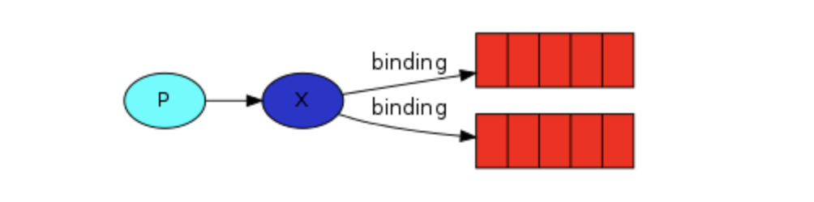

# Note on RabbitMQ

Durability
==============
- rabbitmq是内存型的消息队列：
	- 当没有显式说明队列是持久化的，那么队列就是临时的（内存中），当rabbitmq server重启，队列就不存在了。
	- 当没有显式说明消息是持久化的，消息也是临时的（内存中），当rabbitmq server重启，而且消息没有被消费，消息就不存在了。
	- 默认消息在内存中，消费后就会被标记清除。
		- 当开启了ack配置，而大量消息没有被ack(没有来得及，或者代码bug忘了ack)的情况下，server的内存可能会被撑爆。

注意：即使开启了持久化，rabbitmq底层也不会对每个消息进行`fsync`，所以也不是百分之百的不丢消息。如果需要更强的约束，可以使用[Publisher Confirm机制](https://www.rabbitmq.com/confirms.html)

默认情况下，exchange, queue, message都是不持久化的，server重启，全部消失。
另外有一个匿名queue的概念，匿名queue是一次性的，创建它的进程退出，匿名queue就销毁。

Ack
==============

- 消息消费默认是不发送ack，但是可以使用，使用的时候：
	- 在消费端激活ack配置
	- 在消费代码内添加ack代码

__注意__：如果开启了ack配置，但是代码内忘记了ack，那么消息就会一直存在于server的内存中，有可能会撑爆server内存。


prefetch
==============

`prefetch=1` 让rabbitmq consumer一次只处理一条消息，只有处理完，server才会投递给它下一条。
```
# usage
$channel->basic_qos(null, 1, null);

# proto
    /**
     * Specifies QoS
     *
     * @param int $prefetch_size
     * @param int $prefetch_count
     * @param bool $a_global
     * @return mixed
     */
    public function basic_qos($prefetch_size, $prefetch_count, $a_global)
    {
```

模式
==============


rabbitmq的核心概念是
- exchange(图中X)
- queue(图中红色部分)

通过exchange和queue的动态绑定，来实现路由。

一般流程：Producer发消息到Exchanger，Exchanger和Queue通过某种模式绑定，Consumer通过Queue来消费。

Exchanger模式：
- direct 默认模式，此种模式下可以实现很多场景。不同场景的实现，主要通过routing_key的设置。
    - 消息路由的实现
        - 当Queue绑定到Exchanger的时候，需要指定一个routing_key
        - 当producer发送消息到Exchanger的时候，需要制定一个routing_key
        - 通过两个routing_key的匹配实现路由功能。需要说明的是routing_key本身是支持模糊匹配的，从而实现了不同的路由策略。
    - 场景
        - 1vs1。使用匿名Exchanger，routing_key指定为一个queueName即可。producer->Exchanger->queue->consumer
        - 1vsN。同上，但是可以启动多个consumer，Server轮询发送消息给各个consumer，每个消息只会投递一次。
        - 1vsXN。使用命名Exchanger
            - 每个consumer启动匿名queue，并绑定指定routing_key到Exchanger
            - producer发送消息时，指定routing_key，不同consumer只会接收到自己注册的routing_key对应的消息
        - 1vsFN。同上，但是routing_key是特殊的。
            - 比如consumerA 注册了routing_key: "user.*","reg.center.*"
            - consumerB注册了routing_key: "admin.*","*.id"
            - 当producer生产了一个消息，routing_key=
                - "user.a"，consumerA可以收到
                - “admin.m”, consumerB可以收到
                - “user.id”, consumerA,consumerB都可以收到
                - “x.y.z” 被丢弃

- fanout 广播模式，此种模式下所有消息都会投递到所有consumer
    - producer
        - 启动一个fanout模式的Exchanger
        - 生产数据
    - consumer
        - 每个consumer启动一个匿名queue
        - 绑定到Exchanger
        - 消费queue
        - (进程退出，queue自动销毁)

更多参考 https://www.rabbitmq.com/tutorials/tutorial-one-php.html


适用场景与对比
==============

**不适用**
- 内存型消息队列，虽然支持持久化但是性能会有较大影响。对持久化有需求的场景，优先使用Kafka
- 不支持回溯，因为消息消费完就删除。如果需要支持回溯，及自定义消费偏移，使用Kafka
- 高吞吐量的场景，Kafka表现更优 http://jm.taobao.org/2016/04/01/kafka-vs-rabbitmq-vs-rocketmq-message-send-performance/
- 消息消费有较大延迟或者堆积的场景，不建议使用RabbitMQ
    - 因为是内存型，所有消息都在内存，当开启了ack而大量消息没有被ack的情况下，消息堆积有可能撑爆内存。比如消费端挂了几个小时，对RabbitMQ server 的性能影响很大。

**适用**
- 简单场景，实时